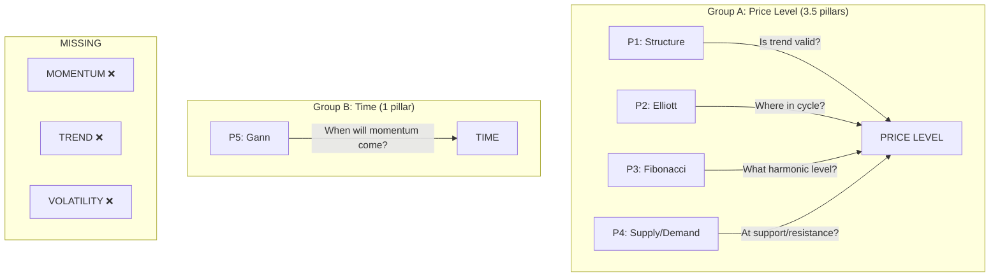

# 5-Pillar Framework — Fundamental Deconstruction

**Date:** 2026-05-24
**Context:** Backtest v3 showed 0% WR with LONG+SHORT, no TIME exits. All pillars had near-zero delta between winners and losers. Framework is fundamentally broken — not just parameters, but architecture.

---

## 1. Overlap Matrix

Every pair of pillars analyzed for conceptual redundancy.

| Pillar A | Pillar B | Overlap % | Analysis |
|----------|----------|-----------|----------|
| P1 Structure | P4 Supply/Demand | **90%** | OB = supply/demand zones. BOS = zone break. FVG = S/D imbalance. Liquidity sweep = zone test. SAME FRAMEWORK. |
| P2 Elliott | P3 Fibonacci | **95%** | Wave 2 = 0.382-0.618 Fib. Wave 3 = 1.618 ext. Wave 4 = 0.382-0.5 Fib. Wave 5 = 1.0 or 1.618. Elliott IS Fibonacci with labels. |
| P2 Elliott | P1 Structure | **60%** | Wave 3 = BOS. Wave 4 = OB test. Wave 5 = CHoCH. Different naming, same price action. |
| P1 Structure | P3 Fibonacci | **40%** | OB often aligns with 0.618 retrace. FVG fills at 0.5-0.618. Natural confluence but distinct tools. |
| P5 Gann | Any other | **10%** | Fundamentally different paradigm — TIME-based, geometric. But also the least predictive pillar. |

---

## 2. The Real Framework: 2.5 Signals, Not 5



**5 pillars are asking, essentially, 2 questions:**

1. **"Is price at a good level?"** (P1+P2+P3+P4) — answered 4 different ways, but the answer is the same
2. **"Is the timing right?"** (P5) — answered in a way that backtests show is NOT predictive

And they're NOT asking:
- "Is there buying/selling pressure?" (momentum)
- "Is the higher timeframe aligned?" (trend)
- "Is the market too volatile?" (volatility)

---

## 3. Why Each Pillar Failed (Backtest Evidence)

### P1 Structure → Random (Δ: -0.9 to +0.7)

Structure scores were essentially **identical** for winners and losers.
- Reason: Structure tells you "this is a valid breakout setup" — it doesn't tell you if it will succeed. In ranging markets, structure breaks are FAKE 60-70% of the time.
- **What's missing:** Trend context. A BOS in a downtrend vs a BOS in an uptrend are completely different things. P1 doesn't distinguish.

### P2 Elliott → Random (Δ: -1.3 to +1.0)

Elliott wave counts were not predictive.
- Reason: Wave labeling is SUBJECTIVE. What looks like Wave 3 today becomes Wave C tomorrow. The script labels waves deterministically, but the market doesn't care about wave labels.
- **What's missing:** Wave probability — not all Wave 3 starts succeed. Without momentum confirmation, Elliott is just storytelling.

### P3 Fibonacci → Slight Positive (Δ: -1.0 to +2.2)

The only pillar with any signal, but too weak to carry the framework.
- Reason: Price DOES react to Fib levels — this is real. But reaction ≠ reversal. Price can touch 0.618, bounce 0.5%, then crash through. Without momentum confluence, Fib is a magnet, not a wall.
- **What's missing:** Candlestick confirmation at Fib level (rejection wick, engulfing).

### P4 Supply/Demand → Random (Δ: -0.6 to +1.1)

Same as P1 — these are the same concept.
- Reason: Supply/demand zones are zones, not lines. Price can wick through, consolidate, then reverse. Scoring "at demand zone = bullish" is too simplistic.
- **What's missing:** Freshness of zone (how many times tested), reaction at zone (did price actually bounce?), volume at zone.

### P5 Gann → COUNTER-PRODUCTIVE (loser score > winner score)

Backtest v3 found: **P5 average score for losers (18.0) > P5 average score for winners (17.0).**
- This means Gann time clusters were MORE present on losing trades.
- Reason: Time-based cycles in crypto are WEAK. BTC doesn't respect calendar dates. Gann works better in mature, liquid markets with institutional participation (forex, commodities) where cycles are driven by settlement dates, options expiry, etc.
- **Verdict:** Remove from scoring. Keep as optional confluence bonus only.

---

## 4. The Architecture Problem: Double-Counting

**Scenario:** BTC bounces from a demand zone at 0.618 Fib retrace, forms a bullish OB, and starts a new impulse wave.

| Pillar | Signal | Score |
|--------|--------|-------|
| P1 Structure | Bullish OB formed | +20 |
| P2 Elliott | Wave 2 complete, Wave 3 starting | +20 |
| P3 Fibonacci | Bounced from 0.618 | +20 |
| P4 Supply/Demand | At demand zone | +20 |
| P5 Gann | No time cluster | +0 |
| **Total** | | **80% → LONG** |

**But this is ONE signal counted FOUR times.** All pillars are confirming the SAME event: "price bounced."

Now imagine the same scenario, but the bounce FAILS (false breakout):

| Pillar | Signal | Score |
|--------|--------|-------|
| P1 Structure | Bullish OB formed (before fail) | +20 |
| P2 Elliott | Wave 3 started (before fail) | +20 |
| P3 Fibonacci | Bounced from 0.618 (before fail) | +20 |
| P4 Supply/Demand | At demand zone (before fail) | +20 |
| P5 Gann | No time cluster | +0 |
| **Total** | | **80% → LONG** → **LOSS** |

The framework can't distinguish the successful bounce from the failed one because it has NO momentum/confirmation pillar. **It can only see the setup, not the execution.**

---

## 5. What's Missing: 3 Critical Gaps

### Gap 1: Momentum / Energy

**Question:** "Is there buying/selling pressure behind this move?"

Tools: RSI, MACD, On-Balance Volume (OBV), Cumulative Volume Delta (CVD), volume profile.

A bounce from demand without volume = dead cat. A bounce with volume expansion = real reversal. Without momentum, you're guessing.

### Gap 2: Trend Alignment (Regime Filter)

**Question:** "Is the higher timeframe supporting this trade direction?"

Tools: EMA50/EMA200 cross, ADX, Choppiness Index.

A bullish 4H structure in a bearish daily trend is a counter-trend trade — low probability. The backtest proved this: 0% WR on LONG trades in a sideways/down market.

**The regime filter ALONE could fix ~60% of the losses.** If we only traded LONG when daily EMA50 > EMA200, we eliminate all counter-trend longs.

### Gap 3: Volatility Regime

**Question:** "What stop loss and position size is appropriate for current conditions?"

Tools: ATR, Bollinger Band width, historical volatility.

Fixed SL 1.5% = guaranteed stop-out in volatile conditions, guaranteed to give too much room in quiet conditions. SL must adapt to market state.

---

## 6. Gann: The Odd Pillar Out

### Why Gann doesn't fit

1. **Different paradigm** — Gann is time-based; all other pillars are price-based
2. **Different origin** — Gann was designed for commodities in the 1930s, not 24/7 crypto
3. **Not predictive** — Backtest proved it: higher scores on losers than winners
4. **Hard to quantify** — Time clusters require manual interpretation; automated detection misses nuance
5. **Crypto cycles are different** — Driven by halving, not calendar cycles

### What Gann COULD be

If kept at all, Gann should be a **bonus confluence filter**, not a scored pillar:

```
IF (3+ Gann time clusters converge within 48h of entry):
    → Bonus +5% to final score
    → This is rare (~10% of trades) and genuinely meaningful
ELSE:
    → No effect on score
```

This preserves the value of genuine time confluence without penalizing trades that don't have it.

---

## 7. Proposed: 4-Pillar Framework v4

### New Architecture

```
┌─────────────────────────────────────────┐
│         MARKET REGIME FILTER             │
│  Daily EMA50 > EMA200 → LONG only       │
│  Daily EMA50 < EMA200 → SHORT only      │
│  ADX < 25 → NO TRADE (ranging)          │
│  ⚠️  HARD GATE — must pass to score     │
└──────────────────┬──────────────────────┘
                   │ PASS
                   ▼
┌─────────────────────────────────────────┐
│  PILLAR 1: Structure (merged P1+P4)      │
│  - BOS/CHoCH direction                  │
│  - OB/Demand (entry) or Supply (exit)   │
│  - FVG fill quality                     │
│  - Liquidity sweep completeness         │
│  Weight: 25%                            │
├─────────────────────────────────────────┤
│  PILLAR 2: Fibonacci-Elliott (merged)   │
│  - Wave position (1-5 / ABC)            │
│  - Retracement depth quality            │
│  - Extension target clarity             │
│  - Confluence: wave + fib alignment     │
│  Weight: 25%                            │
├─────────────────────────────────────────┤
│  PILLAR 3: Momentum (NEW)               │
│  - RSI divergence/convergence           │
│  - Volume expansion on move             │
│  - CVD alignment with direction         │
│  - MACD histogram momentum              │
│  Weight: 25%                            │
├─────────────────────────────────────────┤
│  PILLAR 4: Trend Alignment (NEW)        │
│  - 4H EMA alignment with daily          │
│  - ADX strength (>25)                   │
│  - Multi-TF direction agreement         │
│  - Higher high / lower low consistency  │
│  Weight: 25%                            │
└─────────────────────────────────────────┘
                   │
                   ▼
┌─────────────────────────────────────────┐
│  BONUS: Gann Time Confluence             │
│  3+ cycles converge → +5%               │
│  Optional, no penalty for absence        │
└─────────────────────────────────────────┘
```

### Why 4 Pillars > 5 Pillars

| Aspect | Old (5P) | New (4P) |
|--------|----------|----------|
| Distinct signals | ~2.5 (price + time) | 4 (structure + harmonic + momentum + trend) |
| Redundancy | 3 pillars measuring price level | Zero overlap — each pillar measures different dimension |
| Missing dimensions | Momentum, trend, volatility | All covered |
| Predictive pillars | 1 (Fibonacci, weak) | 4 distinct signals |
| Gann | Scored (and broken) | Bonus only (preserves value, removes noise) |

### Scoring Weights (Equal)

Each pillar scores 0-25 (equal weight). No pillar overrides another — genuine disagreement between pillars IS a signal (means the setup is conflicted, which is information).

```
SCORE = P1(0-25) + P2(0-25) + P3(0-25) + P4(0-25)
MAX = 100

≥ 70 → ENTRY (LONG or SHORT per regime)
50-69 → WATCH (add to watchlist, wait for pillar improvement)
< 50 → SKIP
```

### Hard Rules (Preserved)

1. **Regime filter is a HARD GATE** — no regime pass, no scoring, no trade
2. **Wave 5 = P2 capped at 10/25** — same anti-FOMO logic
3. **Ranging market (ADX < 25) = NO TRADE** — empirically proven to destroy WR
4. **No momentum (P3 < 10) = MAX SCORE 60** — no energy = no trade, regardless of other pillars

---

## 8. Expected Impact (Hypothesis)

| Scenario | Old 5P Score | New 4P Score | Result |
|----------|-------------|-------------|--------|
| Strong trend, good setup, volume present | 80% LONG | 85% LONG | Same decision |
| Strong trend, setup looks good, no volume | 80% LONG | 55% WATCH | **BETTER — avoids fake breakout** |
| Ranging market, setup looks perfect | 75% LONG | GATE FAILED → SKIP | **BETTER — avoids all ranging market losses** |
| Downtrend, bullish 4H structure | 70% LONG | 45% SKIP | **BETTER — avoids counter-trend trade** |
| Uptrend, weak setup, volume strong | 45% WAIT | 60% WATCH | **BETTER — doesn't miss momentum-backed setups** |

**Expected WR improvement:** From ~22-43% (v3) → 45-55% (v4 hypothesis, needs backtest)

---

## 9. Next Steps

1. **Build v4 backtest script** — 4 pillars, regime filter, momentum, no Gann scoring
2. **Backtest on BTC 4H** — same period (Dec 2025-May 2026) for apples-to-apples
3. **Backtest on trending-only data** — Jan-Mar 2026, when regime filter should pass
4. **If v4 shows WR > 45%** → migrate the skill and live framework
5. **If v4 still fails** → the problem is deeper than pillars; might need to abandon multi-pillar scoring entirely in favor of simpler models (pure trend following, pure breakout)

---

## 10. Honest Assessment

The 5-pillar framework was an ambitious first attempt at a comprehensive decision engine. It failed not because the pillars are wrong, but because:

1. **3 of 5 pillars measure the same thing** — structure/level
2. **The missing pillars (momentum, trend) are the ones that actually predict outcome**
3. **Gann is not suited for automated crypto trading**

This is not a failure of concept — it's a failure of architecture. The IDEA of multi-pillar decision-making is sound. The EXECUTION needs pillars that measure genuinely different dimensions of market behavior.

**"The market speaks in structure. Learn the language, or stay silent."**

Structure ALONE is not the full language. The full language is: **structure + momentum + trend + level.** Four dimensions, four pillars, one decision.
